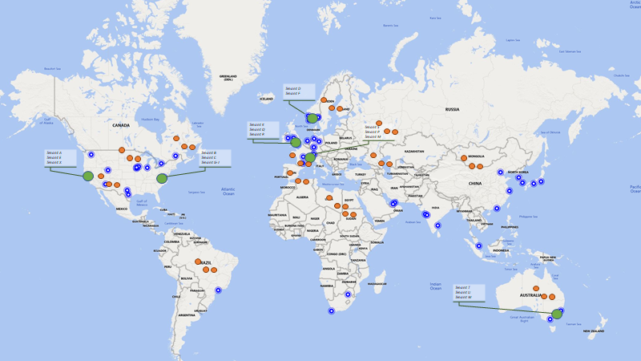

# Using Azure Front Door for multi-tenant, globally deployed applications
## Introduction
If you're building commerical software, you should be thinking about making your web application multi-tenant. This article will explain how Azure Front Door can help route individual users in a multi-tenant, globally deployed application.

To start with, having a multi-tenant web application offers several benefits. For example: 

- Optimized resource usage, as resource capacity claimed is shared over a larger number of customers
- Reduced management overhead, as there is an application deployment for a group of customers - not _per customer_
- Reduced costs, as a result of the optimized resource usage and reduced management overhead. 

A multi-tenant application does not imply that there is a single application deployment supporting all tenants. In fact, going for a single deployment would impose limits to scalability, versioning, management and might complicate matters later. 

Instead, it is a common practice to distribute them across different instances of your application. These different instances are typically referred to as _deployment stamps_ or _scale units_, representing a deployable, independent version of your application aimed to support a subset of the tenants. 

Having multiple deployments allows the architecture to:

- Address scalability limitations of the application and / or the underlying infrastructure
- Isolate particular tenants that have more stringent security requirements / customizations
- Provision tenants in a particular region / geo, allowing the application to support data sovereignty and other legislation

Having multiple deployments also introduces some challenges. As part of architecture and product strategy, we need a plan to direct end-users to the deployment stamp or scale unit that supports their tenant. 

## The application
Assume that the application is build on Azure App Services and deployed in 6 geographies: EastUS, WestUS,  Europe, France, Norway and Australia. The application's architecture caters for disaster recovery scenarios by having a secondary (active) deployment in the paired region. 

Out of the box, this means that the application can be connected via 6 primary + 6 secondary URLs: 

| Region | Primary | Secondary | Tenants | 
| --- | --- | --- | --- |
| East US | https://app-eastus-stamp1-region1.azurewebsites.net | https://app-eastus-stamp1-2.azurewebsites.net | A, E, X |
| West US |https://app-westus-stamp1-region1.azurewebsites.net | https://app-westus-stamp1-2.azurewebsites.net | B, C, G-J |
| Europe | https://app-europe-stamp1-region1.azurewebsites.net | https://app-europe-stamp1-2.azurewebsites.net  | K, Q, R |
| France | https://app-france-stamp1-region1.azurewebsites.net | https://app-france-stamp1-2.azurewebsites.net| S, P, M |
| Norway | https://app-norway-stamp1-region1.azurewebsites.net | https://app-norway-stamp1-2.azurewebsites.net| D, F |
| Australia | https://app-australia-stamp1-region1.azurewebsites.net  | https://app-australia-stamp1-region2.azurewebsites.net | T, U, W |

## Routing
The default URLs are not user friendly. They are hard to remember, easy to mistype, impossible to change without impacting the users and simply do no justice to the quality of the actual product. 

Instead, a DNS record (CNAME, most likely) will be created. Such a record provides a great opportunity to route individual users to the appropriate stamp - or does it? 

Let's look at the different strategies that are possible, and evaluate their appeal (subjectively):

| Strategy | User Friendly URL | Routable to a particular stamp? | Achievable via | Notes | 
| -------- | ----------------- | ------------------------------- | -------------- | ----- |
| https://app.contoso.com | ++ | -- | AFD, TM | Works well in combination with a tenant discovery service / redirection to one of the other, more routable URLs. Alternatively, the redirection service could add a request header value that maps the request to the desired tenant / stamp - this is possible via the _Rules Engine_ (Preview)  |
| https://**stamp**.app.contoso.com | -- | ++ | AFD, TM | Shares internal working of the system with customers. Limits flexibility in management, e.g. rebalancing tenants across stamps.       |
| https://**tenant**.app.contoso.com| + | ++ | AFD, TM | DNS-only routing possible. Fixed URL allows for later rebalancing across stamps (in a region). |
| https://app.contoso.com/**tenant** | + | ++ | AFD |  |
| https://app.contoso.com/**?tenant=Tenant** | -- | +/- | AFD | Requires the use of the Azure Front Door _Rules Engine_ (which is in preview, with unknown limits) |

### Tenant discovery service
Part of the routing challenge can be addressed by a specialized service. A Tenant Discovery Service can act as the default landing zone for the application, responsible for mapping (authenticated) users to the corresponding tenant capacity. 

The flow would look as follows: 

1. User navigates to https://app.contoso.com
2. The initial request is generic and not yet mapped to a tenant. The system forwards the request to the tenant discovery service.
3. The tenant discovery service attempts to find the corresponding tenant.
    - This could be via a reference table or an algorithm based on the user's identity, or otherwise.
    - Users that are associated with more than one tenant could be presented with a web page that lists their options.
4. Once the tenant is identified, the discovery service responds with a _HTTP 302 - Redirect_ response.
5. The browser follows the redirect, ensuring that the user ends up at the target location. 

To redirect, the tenant discovery service can:

- Redirect to a routable URL (stamp.app.contoso.com, tenant.app.contoso.com, app.contoso.com/tenant, app.contoso.com/?tenant=tenant)
- Inject a routable header value. This is only possible if the discovery service and the application are under the same domain, as it depends on a domain-level cookie (custom headers are lost as part of the 302 redirect).

### Azure Front Door
In the previous table, there have been few references to Azure Front Door to support the required routing. 

_Note that Azure Front Door is a complete application delivery controller, offering features beyond request routing. It can be used to add a variety of performance, security and availability-related features to your application. 
From the [docs](https://docs.microsoft.com/en-us/azure/frontdoor/front-door-overview):_

    Azure Front Door enables you to define, manage, and monitor the global routing for your web traffic by optimizing for best performance and instant global failover for high availability. With Front Door, you can transform your global (multi-region) consumer and enterprise applications into robust, high-performance personalized modern applications, APIs, and content that reaches a global audience with Azure.

    Front Door works at Layer 7 or HTTP/HTTPS layer and uses anycast protocol with split TCP and Microsoft's global network for improving global connectivity. So, per your routing method selection in the configuration, you can ensure that Front Door is routing your client requests to the fastest and most available application backend. An application backend is any Internet-facing service hosted inside or outside of Azure. Front Door provides a range of traffic-routing methods and backend health monitoring options to suit different application needs and automatic failover models. Similar to Traffic Manager, Front Door is resilient to failures, including the failure of an entire Azure region._

A Azure Front Door resource is configured around the following concepts:
- **Frontend endpoints**, defining the public URLs / domains that are processed via Front Door. E.g. 'contoso.azurefd.net' is a frontend endpoint.
- **Backend pools**, define a logical grouping of backend server endpoints. Strategies on load balancing, priority routing and health monitoring are defined here. E.g. "EastUSStamp1" can be a backend pool, where "https://app-eastus-stamp1-region1.azurewebsites.net" and "https://app-eastus-stamp1-region2.azurewebsites.net" are the backend servers.
- **Routing rules**, map incoming requests to a particular backend pool. Uses the host name (contoso.azurefd.net, app.contoso.com) domain and path to forward or redirect a request. 
- **Web Application Firewall**, a set of security policies that can be associated with a frontend-endpoint or domain. Rules can allow, block, log or redirect requests based on their geo, IP and other criteria.
- **Rules Engine (Preview)**, to modify the incoming requests based on request-specific conditions. This is evaluated after WAF and initial routing has been completed, but before the request is actually forwarded or redirected. 

The scaling limits of Azure Front Door are documented [here](https://docs.microsoft.com/en-us/azure/azure-resource-manager/management/azure-subscription-service-limits#azure-front-door-service-limits).

## Scalability limits
In many situations, the application can use a Tenant Discovery Service. This offers the benefit of having a single, user friendly URL and is flexible towards the management of stamps, users and tenants, cost effective and offers limitless scalability.

Unfortunately, having a central Tenant Discovery Service is not always possible or desirable. Reasons will vary: there might be an existing application that does not support it, time or capacity constraints or strong preference NOT to have a centralized store (or method) to map users to their tenants. 

When ruling out the Tenant Discovery Service, there are 2 options remaining: https://tenant.app.contoso.com and/or https://app.contoso.com/tenant. 

Both can be routed directly via Azure Front Door; each will benefit from a slightly different approach and limits: 

### Routing via https://tenant.app.contoso.com

This strategy depends on a combination of Azure Front Door and DNS-based request routing. It considers Azure Front Door to be a scale unit itself, defining a group of related stamps / tenants routes to optimize manageability and scalability. For example: start with an Azure Front Door resource per geography, supporting up to 500 tenants in that single resource - linearly scaling up to 100 resources (50,000 tenants) per subscription (and before contacting support).  

There are some downsides to this approach. Although Azure Front Door scaling is practically limitless in the setup, there are other considerations: 

- [DNS Limits](https://docs.microsoft.com/en-us/azure/azure-resource-manager/management/azure-subscription-service-limits#azure-dns-limits). This may vary, depending on the DNS provider but as as an example, Azure DNS allows you to create up to 10,000 record sets per public zone - well below the theoretical maximum of Azure Front Door.
- [Costs](https://azure.microsoft.com/en-us/pricing/details/frontdoor/). The approach implies an additional cost per tenant (of approx. $5/month) for the domain. 
- Effort. The approach requires management of both DNS and Azure Front Door, for every tenant onboarding. Wildcard DNS entries do not provide a solution here: these entries can only map to a single Azure Front Door endpoint and can only be associated with a single Azure Front Door resource.

### https://app.contoso.com/tenant

This strategy centralizes on Azure Front Door. In DNS, only a single entry is registered, mapping to the Azure Front Door resource. 

Within the resource, routing rules are defined per stamp, defining a routing rule condition that is based on the path. 

There are some downsides to this approach, mostly regarding the scalability. As this approach is limited to a single Azure Front Door resource, it supports up to 50 backend pools and up to 12,500 tenants (i.e. 500 routing rules per resource, 25 patterns per routing rule) (before contacting support).

## Conclusion
Building a globally deployed service takes some planning, making it multi-tenant only adds to the complexity. In the ideal world, using a Tenant Discovery Service is the best available option. 

In case that isn't a possibility (yet), one should carefully look at the alternatives and their limitations - and go for the option that is most appropriate based on the unique criteria of their application. 
